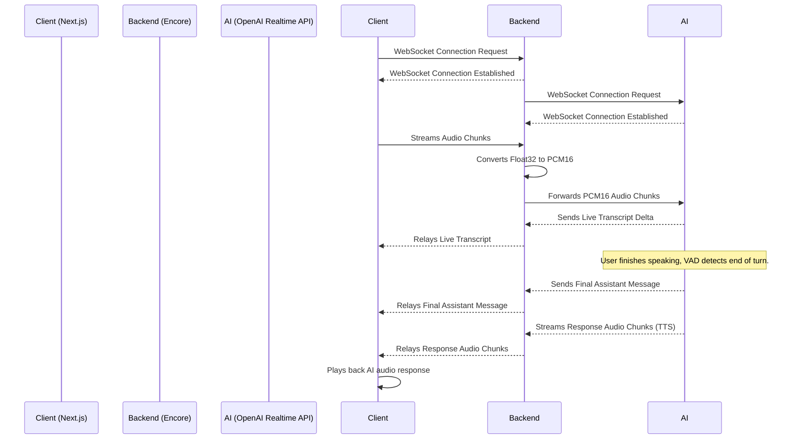

# Real-Time Voice AI Assistant

This project is a full-stack application that demonstrates real-time, bidirectional communication with an AI assistant. It uses a Next.js frontend to capture audio, an Encore backend to manage the connection, and the OpenAI real-time API for speech-to-text (STT), AI responses, and text-to-speech (TTS).

## Key Features

- **Real-Time Audio Streaming**: Captures microphone audio in the browser and streams it to the backend.
- **Live Transcription**: Receives and displays live speech-to-text transcripts from the AI.
- **Intelligent Responses**: The AI assistant processes the conversation and provides intelligent, spoken responses.
- **Real-Time Text-to-Speech (TTS)**: Plays the AI's audio response back to the user in real-time.
- **WebSocket Communication**: Utilizes WebSockets for low-latency, full-duplex communication between the client, backend, and AI service.

## Architecture

The application is divided into two main components: a `frontend` built with Next.js and a `backend` powered by Encore.

- **Frontend**: A client-side application that handles user interaction, captures microphone audio using an `AudioWorklet`, and communicates with the Encore backend via a WebSocket. It's also responsible for playing the audio responses from the AI.
- **Backend (Encore)**: Acts as a stateful proxy between the client and the OpenAI API. It manages WebSocket connections from clients and forwards audio data to OpenAI. It also receives responses from OpenAI (transcripts, AI messages, audio) and relays them back to the correct client.

### Flow Diagram



## Getting Started

Follow these instructions to get the project up and running on your local machine.

### Prerequisites

- Node.js and npm
- [Encore](https://encore.dev/docs/install) installed on your machine.

### Backend Setup

1.  **Navigate to the backend directory:**
    ```bash
    cd backend
    ```

2.  **Install dependencies:**
    ```bash
    npm install
    ```

3.  **Set up environment variables:**
    Encore uses a secrets system. You will need to set your OpenAI API key and the API URL.

    ```bash
    encore secret set --type dev GPT_API_KEY
    # Paste your OpenAI API key when prompted

    encore secret set --type dev GPT_URL
    # Paste the OpenAI Realtime API URL when prompted (e.g., wss://api.openai.com/v1/realtime/sessions)
    ```

4.  **Run the backend service:**
    ```bash
    encore run
    ```
    The backend will be available at `ws://127.0.0.1:4000`.

### Frontend Setup

1.  **Navigate to the frontend directory:**
    ```bash
    cd frontend
    ```

2.  **Install dependencies:**
    ```bash
    npm install
    ```

3.  **Run the development server:**
    ```bash
    npm run dev
    ```
    The frontend will be available at `http://localhost:3000`.

4.  **Connect and Interact**:
    Open your browser to `http://localhost:3000`, click "Connect", and start speaking.

## Environment Variables

-   `GPT_API_KEY`: Your secret API key for OpenAI.
-   `GPT_URL`: The WebSocket URL for the OpenAI Real-Time API.

## Potential Improvements

While this project is a functional proof-of-concept, here are several areas where it could be improved:

- **Client-Side Audio Conversion**: The conversion from `Float32Array` to 16-bit PCM is currently handled by the backend. This adds computational load to the server. Moving this conversion to the frontend's `AudioWorklet` would be more efficient, as it would distribute the processing load across clients and reduce the amount of data sent over the WebSocket.

- **Explicit End-of-Turn Signal**: Currently, the application relies on OpenAI's server-side Voice Activity Detection (VAD) to determine when a user has finished speaking. This can sometimes be unreliable. Implementing a manual "commit" signal (e.g., when the user stops the microphone) would give more explicit control, ensuring the AI responds at the right time. The backend already has a case for an `audio_f` message, but the frontend doesn't send it.

- **Configuration Management**: Key parameters like audio sample rate, buffer size, and OpenAI model settings are hardcoded. Moving these to a shared configuration file or managing them through environment variables would make the application more flexible and easier to maintain.

- **Error Handling and Resilience**: The error handling can be made more robust. For example, the backend could implement a retry mechanism for connecting to OpenAI, and the client could handle WebSocket disconnections more gracefully, attempting to reconnect automatically.

- **State Management**: The frontend uses several `useState` and `useRef` hooks to manage its state. For a more complex application, using a dedicated state management library (like Redux or Zustand) could help organize the state and make it more predictable.

---


